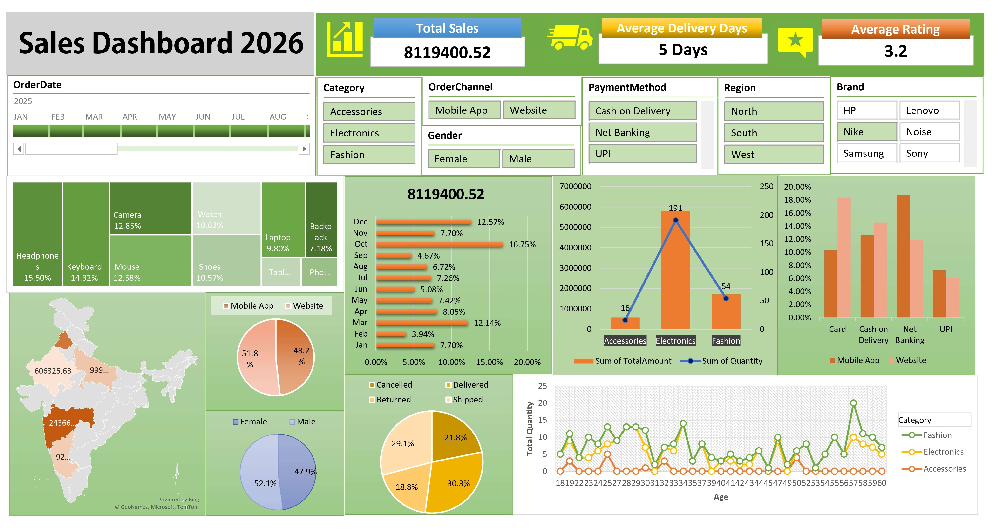

# 📊 Retail Sales Excel Dashboard

<p align="center">
  
</p>

---

## 📌 Project Overview

This project demonstrates how Microsoft Excel can be used as a Business Intelligence (BI) tool to analyze retail sales performance...

---


## 📂 Folder Structure

```text
Retail-Sales-Excel-Dashboard/
│
├── Dashboard.xlsx
├── Dataset.xlsx
├── README.md
│
├── Images/
│   ├── Dashboard.png
│   ├── Sales.png
│   ├── KPIs.png
│   ├── Region.png
│   ├── Product.png
│   └── Customer.png
│
├── Documentation/
│   └── Dashboard_Guide.pdf
│
└── Assets/
```

---

# 🛠 Tools Used

<p align="center">


</p>

| Tool | Purpose |
|------|---------|
| Microsoft Excel | Dashboard Development |
| Pivot Tables | Data Summarization |
| Pivot Charts | Data Visualization |
| Slicers | Interactive Filtering |
| Conditional Formatting | Highlight Insights |
| Excel Functions | Data Analysis |

---

# 📊 Dashboard Features

✅ Interactive KPI Cards

✅ Dynamic Pivot Charts

✅ Monthly Sales Analysis

✅ Product Performance

✅ Region-wise Sales

✅ Payment Method Analysis

✅ Customer Insights

✅ Delivery Analysis

✅ Return Analysis

---

# ⭐ Show Your Support

If you like this project, please consider giving it a ⭐ on GitHub!

<p align="center">

</p>
